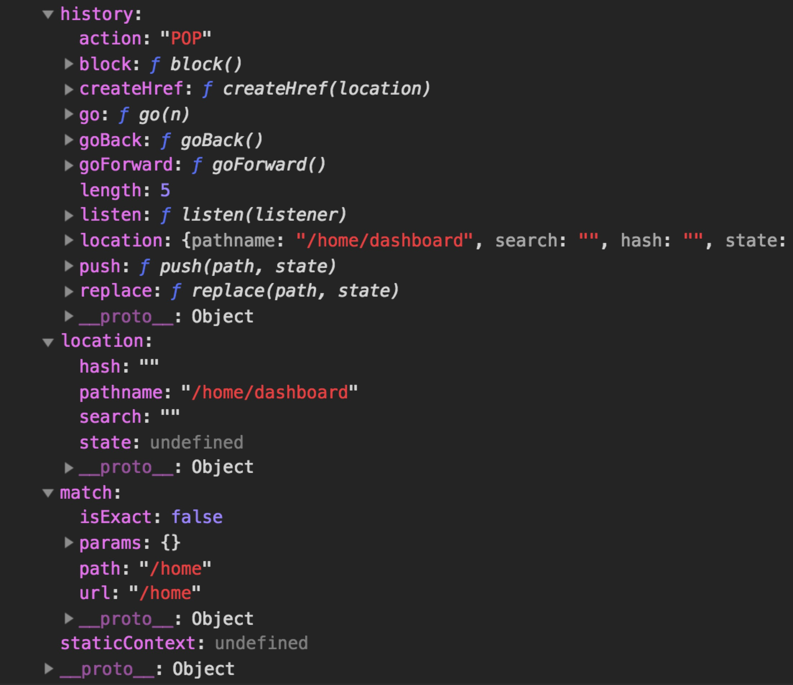

## 路由与组件

### 1、理解路由

开发框架中采用的是前端路由（基于 React Router V4），默认是hash history，其本质是利用浏览器的 History API 进行的路由能力封装。


### 2、理解框架中的【总-分】路由机制

**总路由配置（结合业务模型配置）：**
```
// root/src/routes/index.jsx
import { Router, Route } from "mirrorx";

// Routers
import order from "modules/order/router";
import interimplan from "modules/interimplan/router";
import resource from "modules/resource/router";
import Supplier from "modules/supplier/router";
import contracts from "modules/contract/router";
import system from 'modules/sys-manage/router';
import home from 'modules/home/router'

const MainRoutes = () => (
  <div>
    <Route path="/order" component={order} />
    <Route path="/supplier" component={Supplier} />
    <Route path="/contract" component={contracts} />
    <Route path="/system" component={system} />
    <Route path="/interimplan" component={interimplan} />
    <Route path="/resource" component={resource} />
    <Route path="/home" component={home} />
  </div>
)

```


**业务模型中的详细路由：**
```
// root/src/modules/supplier/router.jsx
import React from "react";
import { Route, Link } from "mirrorx";

import { registerInfo } from "./supplier-manage/containers";
import { supplierList } from "./supplier-list/containers";
import { supplierDetail } from "./supplier-detail/containers";

const Routers = ({ match }) => (
  <div>
    <Route
      exact
      path={`${match.url}/register`}
      component={registerInfo}
    />
    <Route
      exact
      path={`${match.url}/list`}
      component={supplierList}
    />
    <Route
      exact
      path={`${match.url}/detail`}
      component={supplierDetail}
    />
  </div>
);

export default Routers;

```

### 3、理解 router 对象

