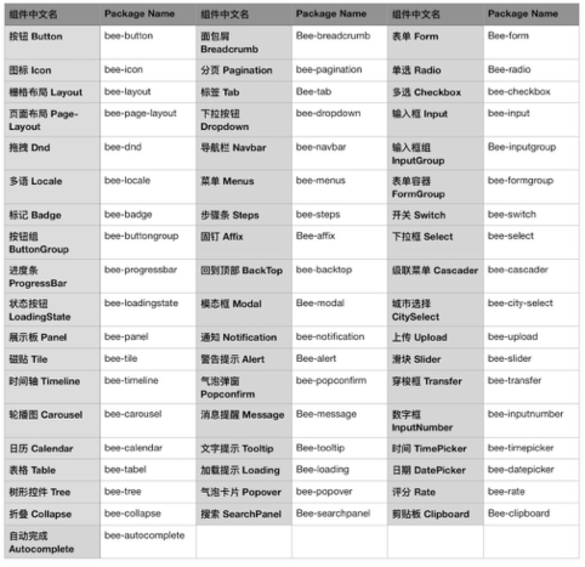

## 前端组件库

### 1、基础组件库 tinper-bee

tinper-bee 是基于 iuap design 设计语言构建的企业级组件库，包含丰富的基础组件和应用组件，支持组件的灵活调用和扩展，助力快速进行应用的组件化开发。组件库地址：http://bee.tinper.org

### 2、应用组件库 tinper-acs

- 参照组件：https://www.npmjs.com/package/yyuap-ref
- 城市级联选择组件：https://github.com/tinper-bee/bee-city-select
- 高级查询组件：https://github.com/tinper-acs/ac-search-panel
- 高级滑动组件：https://github.com/tinper-acs/ac-swiper-tab

### 3、第三方组件

- react-hot-keys：热键/快捷键组件
- react-custom-scrollbars：滚动条优化组件