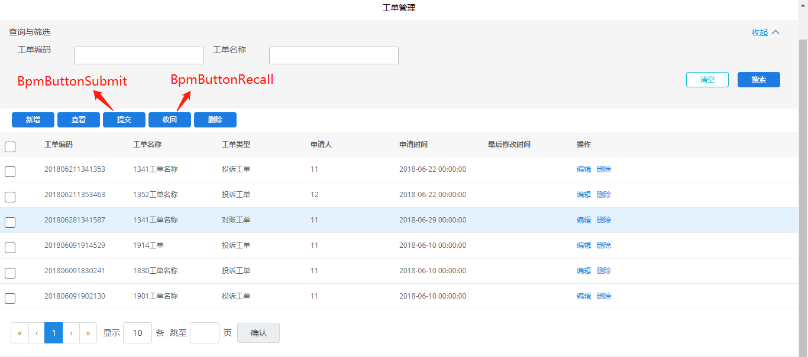
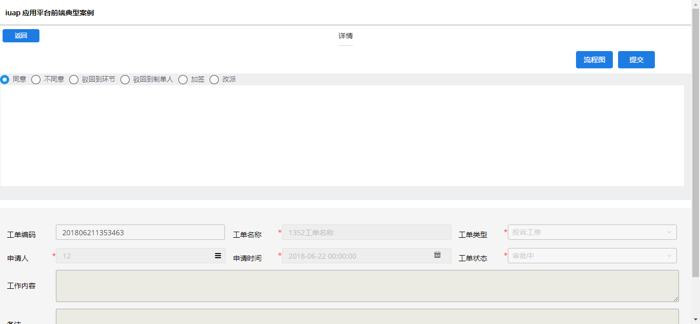
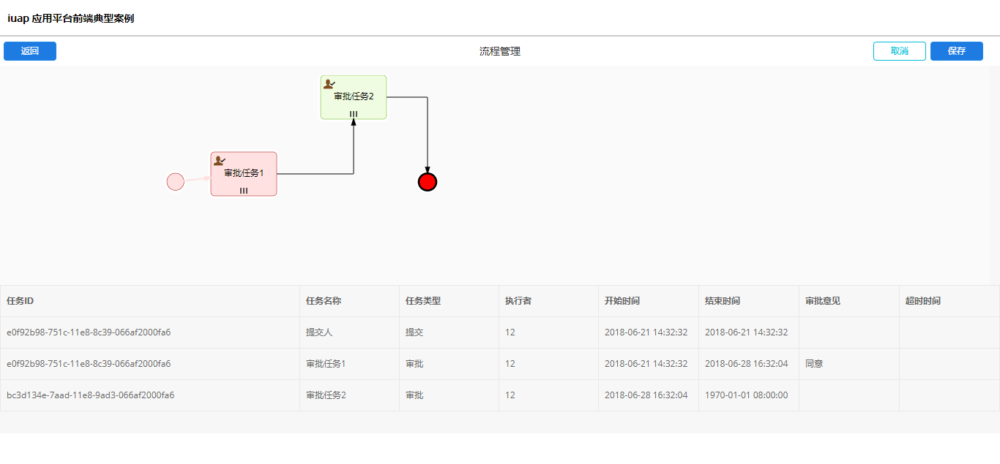
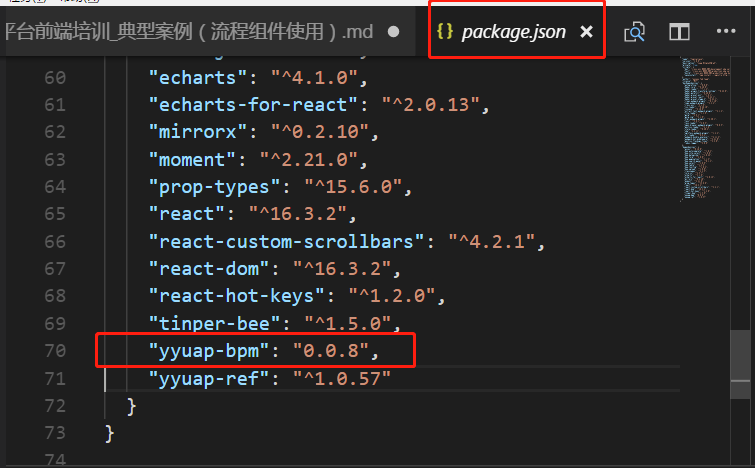
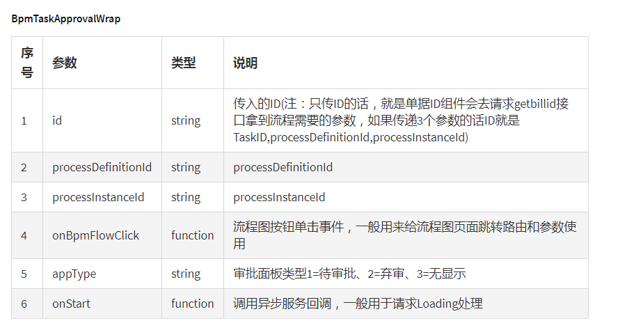

## 流程组件案例

### 1.效果展示
&nbsp;&nbsp;&nbsp;&nbsp;流程组件案例分为三个页面

&nbsp;&nbsp;&nbsp;&nbsp;（1）列表展示页面

&nbsp;&nbsp;&nbsp;&nbsp;列表操作页面可以进行提交、撤回操作，如图所示。


&nbsp;&nbsp;&nbsp;&nbsp;（2）新增、详情、编辑页面,只有在详情页面才可见流程组件，因此本文档所见的form表单页面均为详情页。

下图为详情页，表单未提交状态。


下图为详情页，表单已提交状态，只有已提交单据才可见审批面板和流程图按钮


&nbsp;&nbsp;&nbsp;&nbsp;（3）流程图展示页

如果详情页中存在流程图按钮，则点击流程图按钮可以跳转到流程图展示页。

流程图展示页如图



### 2.环境配置
&nbsp;&nbsp;&nbsp;&nbsp;使用流程组件，需要下载流程组件的npm包

&nbsp;&nbsp;&nbsp;&nbsp;安装npm包,在环境命令窗口将当前路径切换到当前工程下，运行下面的命令

npm install yyuap-bpm --save

安装完成后查看工程package.json中是否有这一安装包的配置项，如下图所示



### 3.代码分析

&nbsp;&nbsp;&nbsp;&nbsp;3.1 路由注册

&nbsp;&nbsp;&nbsp;&nbsp;路由注册文件中主要注册了列表展示页面、详情页、流程图展示页三个页面的地址

&nbsp;&nbsp;&nbsp;&nbsp;这里路由分为了两层,外层，外层路由文件位于src/routes/index.jsx,外层路由

```
<Route path="/templates" component={templates} />
```
内层路由文件在\src\modules\templates\router.js中,在内层路由中注册三个页面地址，注册地址如下
```
<Route exact path={`${match.url}/bpm-table`} component={ConnectedBpmTable} />
<Route exact path={`${match.url}/bpm-card`} component={ConnectedBpmCard} />
<Route exact path={`${match.url}/bpm`} component={BPM} />
```

&nbsp;&nbsp;&nbsp;&nbsp;ConnectedBpmTable 为列表页面

&nbsp;&nbsp;&nbsp;&nbsp;ConnectedBpmCard 为详情页

&nbsp;&nbsp;&nbsp;&nbsp;BPM 为流程图展示页

&nbsp;&nbsp;&nbsp;&nbsp;3.2 提交、撤回按钮代码

提交、撤回按钮位于列表页面中

&nbsp;&nbsp;&nbsp;&nbsp;（1）提交按钮控件的引入
```
import {BpmButtonSubmit,BpmButtonRecall} from 'yyuap-bpm';
```
&nbsp;&nbsp;&nbsp;&nbsp;（2）提交按钮调用代码
```
<BpmButtonSubmit 
    className="editable-add-btn ml5"
    data = {masterData}
    checkedArray = {checkedArray}
    funccode = "react"
    nodekey = "003"
    url = "/iuap_pap_quickstart/example_workorder/submit"
    onSuccess = {this.onSubmitSuc}
    onError = {this.onSubmitFail}
    onStart={this.onSubmitStart}
/>

// 提交成功回调
onSubmitSuc = async ()=>{
    await actions.master.load();
    this.setState({showLine:false }) 
}
// 提交操作开始回调函数
onSubmitStart = ()=>{
    this.setState({showLine:true});
}
// 提交失败回调函数
onSubmitFail = ()=>{
    this.setState({showLine:false});
}
```

&nbsp;&nbsp;&nbsp;&nbsp;（3）字段说明：
字段说明见下图


撤回按钮使用方式与提交按钮相同

&nbsp;&nbsp;&nbsp;&nbsp;3.3 审批面板代码

    审批面板的代码在src/modules/templates/bpm/components/BpmCard/index.jsx,这个页面为详情页

&nbsp;&nbsp;&nbsp;&nbsp;（1）审批面板的引入
```
import { BpmTaskApprovalWrap } from 'yyuap-bpm';
```

&nbsp;&nbsp;&nbsp;&nbsp;（2）审批面板代码

```
onClickToBPM = ()=>{
    console.log("actions",actions);
    actions.routing.push({
        pathname:'/templates/bpm',
        search:`?id=${this.props.rowData.id}`
    })
} 
let bpmClick = this.onClickToBPM;
<BpmTaskApprovalWrap
    id={rowData.id}
    onBpmFlowClick={bpmClick}
    appType={"1"}
/>;

```

&nbsp;&nbsp;&nbsp;&nbsp;（3）字段说明：


注：id为列表数据中，每行数据中的id字段值

onBpmFlowClick为点击流程图按钮时的点击事件，在此事件中页面会跳转到流程图展示页面。

&nbsp;&nbsp;&nbsp;&nbsp;3.3 流程图展示页

流程图展示页位于\src\modules\templates\bpm\components\BPM\Bpm.jsx中

&nbsp;&nbsp;&nbsp;&nbsp;（1）流程图展示组件的引入

```
//querystring一般是对http请求所带的数据进行解析
import queryString from 'query-string';
import { BpmWrap } from 'yyuap-bpm';
```

&nbsp;&nbsp;&nbsp;&nbsp;（2）流程图展示组件的引入

```
let { id, processDefinitionId, processInstanceId } = queryString.parse(this.props.location.search);
```
&nbsp;&nbsp;&nbsp;&nbsp;search字段值见审批面板代码的onClickToBPM事件中,这里只需要传数据id就可以


